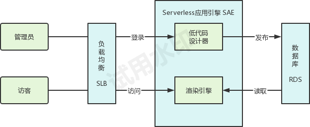
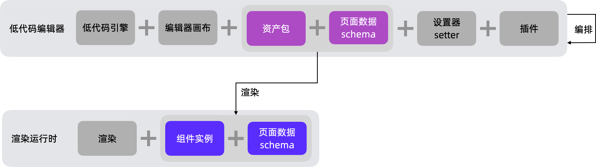

# 赛题简介

（介绍下整体的设计思想、背景，特点功能模块划分，应用场景和效果等）

本项目结合了 [低代码引擎](https://lowcode-engine.cn/) 和 [阿里云 SAE](https://sae.console.aliyun.com/) 的能力，用户能够仅通过简单的操作，拖拉拽即可自动化生成网站。

本项目包含低代码设计器模块和网页展示模块，用户先通过低代码设计器设计好网页，然后发布，可得到一个网站地址，打开即可查看生成的网站。

# 架构图

（介绍软件的技术架构和特点，包括软件的操作系统、运行环境、编程语言、数据存储方式等方面）

操作系统: Linux 容器；前端 Alpine；后端 Ubuntu

运行环境: 阿里云 SAE

编程语言: 前端 TypeScript + React; 后端 Java + Spring Boot

数据存储: 阿里云 RDS

专有网络: 阿里云 VPC

公网访问: 阿里云 SLB

# 安全和稳定性

（介绍软件的安全性和稳定性，包括软件的安全性保障、数据备份和恢复、性能稳定性等方面，可以说明安全性和稳定性如何保证）

# 作品展示

（附上SAE控制台地址，或者一段演示视频，展示作品提供的能力、设计思路、优势亮点等。视频不求形式，讲述清楚即可。）

demo 地址: http://lowcode.imaegoo.com:8080

# 详细设计

1. 用户登录页：包含用户名、密码输入框、登录按钮
2. 网页设计页：包含低代码设计器模块、发布按钮
3. 发布弹窗：包含自定义三级域名输入框，确认按钮、取消按钮
    1. 用户可在地址输入框中输入自定义三级域名，点击确认，网页将发布在 `http://三级域名.lowcode.imaegoo.com:8080`
    2. 用户发布时，如果三级域名未被使用，则创建这个网页，如果三级域名已被使用，则更新这个网页
    2. 用户只能将网页发布到自己的三级域名或无人使用的三级域名上，发布到别人的三级域名将会报错
4. 访客访问三级域名时，将从数据库动态请求该页面内容，在浏览器中渲染展示

# 数据库表结构设计

`lowcode_pages`

- id INT 自增主键
- pageId VARCHAR 50
- title VARCHAR 300
- content LONGTEXT
- createdUser INT 仅关联 users 表的 id，不创建外键
- createdTime TIMESTAMP
- updatedTime TIMESTAMP
- isDeleted INT 1

`lowcode_users`

- id INT 自增主键
- username VARCHAR 100
- password VARCHAR 100
- email VARCHAR 100
- createdTime TIMESTAMP
- updatedTime TIMESTAMP
- isDeleted INT 1

# API

POST `/api/user/login`

- 参数：username, password
- 返回：set-cookie header

POST `/api/page/publish`

- 仅限登录用户调用
- 参数：pageId, title, content
- 返回：success

GET `/api/page/get`

- 参数：pageId
- 返回：title, content
